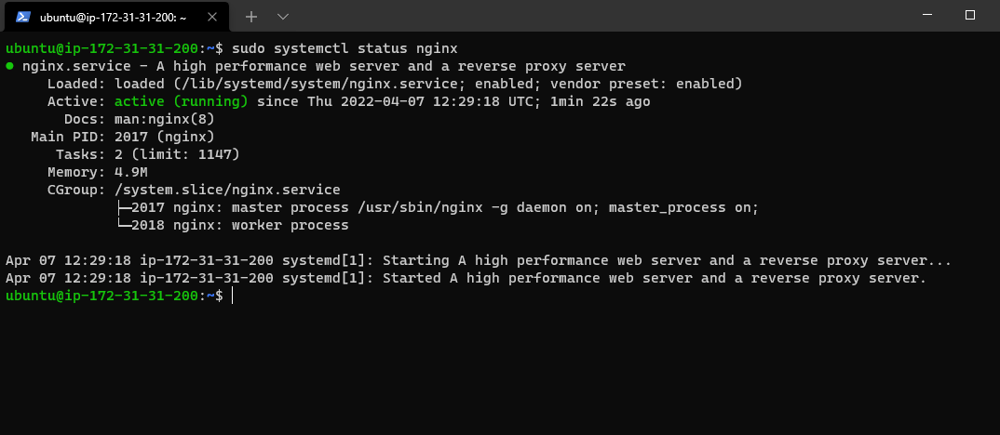
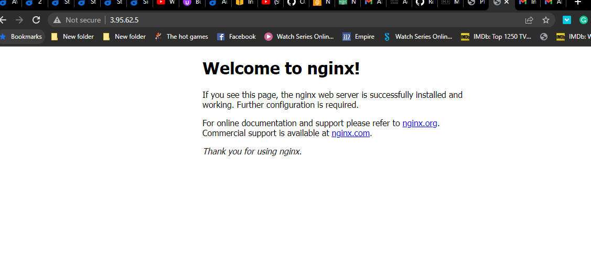
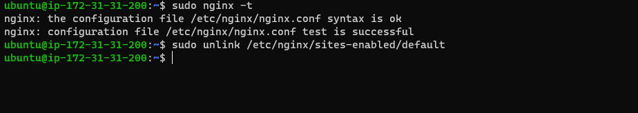
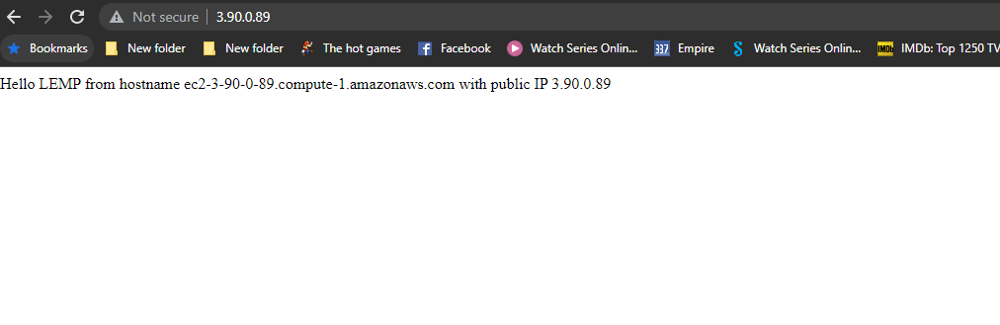
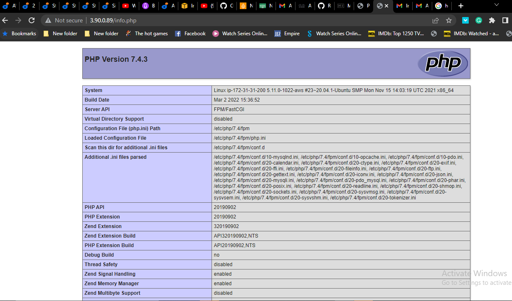
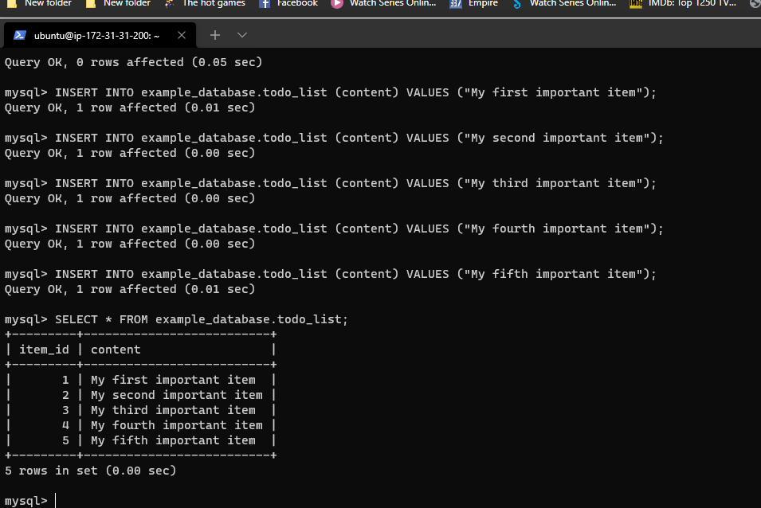
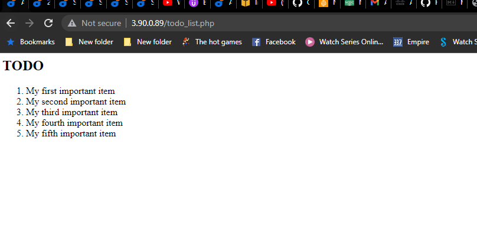

## LEMP Stack Implementation

**Step 1 – Installing the Nginx Web Server**
 
 `sudo apt update`

 `sudo apt install nginx` 

 Check the status of the installed nginx

 `sudo systemctl status nginx`
  
  the nginx is up and running 

  


  

 **STEP 2 — INSTALLING MYSQL**

   use this code 
   `sudo apt install mysql-server`

   for secure installation use 


   `sudo mysql_secure_installation`

**STEP 3 – INSTALLING PHP**

Now you can install PHP to process code and generate dynamic content for the web server ;this is what the php-fpm and php-mysql- handles processes with mysql.

 `sudo apt install php-fpm php-mysql`

 **Step 4 — Configuring Nginx to Use PHP Processor**

Created the root web directory for my domain with the code below:

`sudo mkdir /var/www/projectLEMP`

Change ownwership of the directory created to the current user

`sudo chown -R $USER:$USER /var/www/projectLEMP`


Then, open a new configuration file in Nginx’s sites-available directory using nano:

`sudo nano /etc/nginx/sites-available/projectLEMP`

This creates a new blank file. Paste in the the bare-bones configuration:
```
#/etc/nginx/sites-available/projectLEMP

server {
    listen 80;
    server_name projectLEMP www.projectLEMP;
    root /var/www/projectLEMP;

    index index.html index.htm index.php;

    location / {
        try_files $uri $uri/ =404;
    }

    location ~ \.php$ {
        include snippets/fastcgi-php.conf;
        fastcgi_pass unix:/var/run/php/php7.4-fpm.sock;
     }

    location ~ /\.ht {
        deny all;
    }

}
```

`sudo nginx -t`

 




Disable default Nginx host that is currently configured to listen on port 80, for this run:

`sudo unlink /etc/nginx/sites-enabled/default`

Then reload Nginx to apply the changes:

`sudo systemctl reload nginx`

insert content ninto your webserver with the code below:

```
sudo echo 'Hello LEMP from hostname' $(curl -s http://169.254.169.254/latest/meta-data/public-hostname) 'with public IP' $(curl -s http://169.254.169.254/latest/meta-data/public-ipv4) > /var/www/projectLEMP/index.html
```

test for the content by typing : http://<Public-IP-Address:80   into the browser



**Step 5 – Testing PHP with Nginx**

Create a directory for php content with the code below 

`sudo nano /var/www/projectLEMP/info.php`

paste this configuration
```
<?php
phpinfo();
```

Then access this page in your web browser by visiting the domain name or public IP address you’ve set up in your Nginx configuration file, followed by /info.php. something like this :

```
http://`server_domain_or_IP`/info.php
```

the result




**Step 6 — Retrieving data from MySQL database with PHP**

First, connect to the MySQL console using the root account:

`sudo mysql`

To create a new database, run the following command from your MySQL console:

```
mysql> CREATE DATABASE `example_database`;
```

then creta a user 

` CREATE USER 'example_user'@'%' IDENTIFIED WITH mysql_native_password BY 'Agbokpo123@';`

Grant the user privileges in example_database databse

`GRANT ALL ON example_database.* TO 'example_user'@'%';`

exit and then log into mysql console

`mysql -u example_user -p`

 then show databases `mysql> SHOW DATABASES;`

 Next, we’ll create a test table named todo_list. From the MySQL console, run the following statement:
```
CREATE TABLE example_database.todo_list (
mysql>     item_id INT AUTO_INCREMENT,
mysql>     content VARCHAR(255),
mysql>     PRIMARY KEY(item_id)
mysql> );
```

insert items into the test table

`mysql> INSERT INTO example_database.todo_list (content) VALUES ("My first important item");`


see what you have inserted

`mysql>  SELECT * FROM example_database.todo_list;`




exit and the open a new file with

`nano /var/www/projectLEMP/todo_list.php`

Post this content

```
<?php
$user = "example_user";
$password = "Agbokpo123@";
$database = "example_database";
$table = "todo_list";

try {
  $db = new PDO("mysql:host=localhost;dbname=$database", $user, $password);
  echo "<h2>TODO</h2><ol>";
  foreach($db->query("SELECT content FROM $table") as $row) {
    echo "<li>" . $row['content'] . "</li>";
  }
  echo "</ol>";
} catch (PDOException $e) {
    print "Error!: " . $e->getMessage() . "<br/>";
    die();
}
```

Access this page in web browser by visiting the domain name or public IP address configured for your website, followed by /todo_list.php (the file above): as show below

`http://<Public_domain_or_IP>/todo_list.php`




   